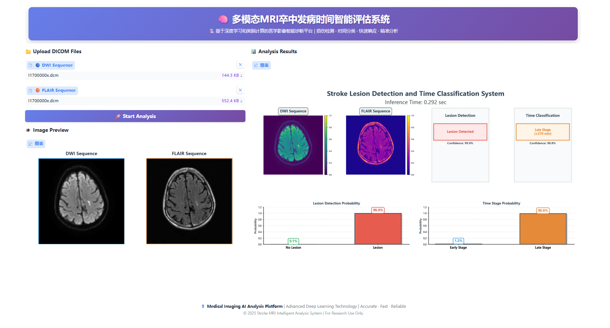

# Brain MRI Stroke Lesion Detection and Time Classification

A deep learning system for automated analysis of brain MRI scans to detect stroke lesions and classify their temporal stage using dual-modality imaging (DWI + FLAIR sequences).

## Overview

This project implements a multi-task neural network architecture for stroke analysis from brain MRI, performing two simultaneous classification tasks:

1. **Lesion Detection**: Binary classification to identify the presence of stroke lesions
2. **Time Classification**: Binary classification to determine stroke timing (early stage <270 min vs. late stage ≥270 min)

The system leverages EfficientNet-B0 as a feature extraction backbone, enhanced with SCAE (Squeeze-and-Channel Attention Enhancement) blocks and spatial attention mechanisms. An optional spiking neural network (SNN) readout head is available for neuromorphic computing exploration.

## Quick Start

```bash
# Install dependencies
pip install torch torchvision pydicom numpy pillow scikit-learn matplotlib gradio

# Train a model
python main.py --epochs 70 --batch_size 32

# Launch Web UI (Recommended)
python gradio_interface.py

# Run inference on a single slice (CLI)
python inference.py \
    --model_path output/model_best.pt \
    --mode slice \
    --dwi /path/to/dwi.dcm \
    --flair /path/to/flair.dcm

# Run inference on a full case (CLI)
python inference.py \
    --model_path output/model_best.pt \
    --mode case \
    --case_dir /path/to/case_dir
```

## 🎨 Web Interface



The system includes a beautiful web-based interface built with Gradio for easy interaction:

### Features
- **Real-time Image Preview**: Automatically displays uploaded DICOM files
- **Dual-Modality Upload**: Support for DWI and FLAIR sequences
- **Interactive Visualization**: Beautiful charts with viridis and plasma colormaps
- **Detailed Results**:
  - Lesion detection with confidence scores
  - Time classification (Early/Late stage)
  - Probability distributions as bar charts
  - Inference time display

### Local Access

```bash
# Start the web interface
python gradio_interface.py

# Access at: http://127.0.0.1:7861
```

### Public Access via Cloudflare Tunnel

To share the interface publicly or access from remote locations, use Cloudflare Tunnel:

**Linux/macOS:**
```bash
# Start the app in background
nohup python gradio_interface.py > app.log 2>&1 &

# Create a public tunnel
./cloudflare/cloudflared-linux-amd64 tunnel --url http://127.0.0.1:7861 &
```

**Windows:**
```bash
# Start the app in background
Start-Process -NoNewWindow -FilePath "python" -ArgumentList "gradio_interface.py"

# Create a public tunnel
./cloudflare/cloudflared-windows-amd64.exe tunnel --url http://127.0.0.1:7861
```

The tunnel will provide a public URL (e.g., `https://random-name.trycloudflare.com`) that can be accessed from anywhere.

### Web UI Usage

1. **Upload DICOM Files**: Click to upload DWI and FLAIR sequence files
2. **Preview**: Images are automatically displayed after upload
3. **Analyze**: Click "🚀 Start Analysis" button
4. **Review Results**:
   - View colorful visualizations with detection results
   - Check confidence scores and probabilities
   - See inference time

## Key Features

### Advanced Architecture
- **Backbone**: EfficientNet-B0 pre-trained on ImageNet with transfer learning
- **Dual-Modality Input**: Processes combined DWI and FLAIR MRI sequences
- **Multi-Scale Feature Fusion**: Integrates mid-level (40 channels) and high-level (1280 channels) features
- **SCAE Attention**: Adaptive channel attention using 1D convolution (kernel size adapts to channel count)
- **Spatial Attention**: 7×7 convolutional attention for spatial feature refinement
- **DropBlock2D**: Advanced regularization technique for CNNs
- **Optional SNN Head**: Leaky Integrate-and-Fire (LIF) neurons for spiking readout layer

### Medical Imaging Processing
- **DICOM Support**: Native handling of medical imaging DICOM format
- **Robust Preprocessing**: Min-max normalization and automatic resizing to 224×224
- **Multi-Frame Handling**: Automatically extracts first frame from multi-frame DICOM files
- **Error Recovery**: Custom collate function handles failed sample loading gracefully

### Training & Evaluation
- **Multi-Task Learning**: Joint optimization with weighted loss combination
- **Comprehensive Metrics**: Accuracy, AUC-ROC, F1-score, sensitivity, specificity, PPV, NPV
- **Cascaded Evaluation**: Time classification evaluated only on lesion-positive predictions
- **Automatic Checkpointing**: Saves best model based on validation AUC
- **Detailed Logging**: Timestamped training logs with epoch-wise metrics

## Architecture Details

### Model Pipeline

```
Input: 2-channel (DWI + FLAIR) 224×224 images
           ↓
EfficientNet-B0 Feature Extraction
           ↓
Multi-Scale Feature Fusion
  ├─ Mid-level (layer 3): 40 channels → Conv1×1 → 128 channels
  └─ High-level (final):  1280 channels → Conv1×1 → 128 channels
           ↓
Adaptive Pooling + Concatenation (256 channels)
           ↓
SCAE Channel Attention (adaptive kernel)
           ↓
Spatial Attention (7×7 conv)
           ↓
DropBlock2D Regularization (block_size=7, p=0.1)
           ↓
Global Average Pooling → [B, 256]
           ↓
    [Optional: LIF Spiking Layer]
           ↓
    ┌─────────────┴─────────────┐
    ↓                           ↓
Lesion Head                Time Head
256→64→2                    256→64→2
(LayerNorm, ReLU)          (LayerNorm, ReLU)
```

### SCAE Block

The SCAE (Squeeze-and-Channel Attention Enhancement) block replaces traditional SE blocks with a more efficient design:

**Key Features**:
- Adaptive kernel sizing: `k = |log₂(C) / γ + b|_odd` where γ=2, b=1
- Uses 1D convolution instead of fully connected layers
- Fewer parameters while capturing local cross-channel interactions
- Better scalability across different feature dimensions

**Operation**:
1. Global Average Pooling: (B, C, H, W) → (B, C, 1, 1)
2. Reshape for 1D conv: (B, C, 1, 1) → (B, 1, C)
3. 1D Convolution: Adaptive kernel size k
4. Sigmoid activation
5. Channel-wise multiplication with input

### Spiking Neural Network (SNN) Option

When enabled with `--use_snn_head`, the model uses a Leaky Integrate-and-Fire (LIF) neuron layer before classification:

- **Purpose**: Converts ANN features to spike trains for neuromorphic computing
- **Implementation**: Uses `snntorch` library with fast sigmoid surrogate gradient
- **Process**:
  - Runs T timesteps (default: 10)
  - Accumulates spikes over time
  - Outputs spike rate (spike_sum / T)
- **Parameters**:
  - `beta`: Leak factor (default: 0.9)
  - `T`: Number of timesteps (default: 10)

### Multi-Task Learning

**Loss Function**:
```
L_total = L_lesion + λ × L_time
```
where λ is the time loss weight (default: 1.0, configurable via `--time_loss_weight`)

**Rationale**:
- Shared backbone learns stroke-related features useful for both tasks
- Time classification logically depends on lesion presence
- More efficient than separate models
- Encourages robust, generalizable representations

## Project Structure

```
mri/
├── main.py                  # Entry point with CLI arguments
├── model.py                 # Neural network architectures
│                            # - SCAEBlock: Channel attention
│                            # - SpatialAttention: Spatial attention
│                            # - DropBlock2D: Regularization
│                            # - EfficientNetB0_2Channel_Fusion: Feature extractor
│                            # - MultiTaskModel: Main model with optional SNN head
├── dataset.py               # Data loading and DICOM preprocessing
├── train.py                 # Training loop with multi-task loss
├── evaluate.py              # Comprehensive evaluation metrics
├── inference.py             # Inference script with visualization
│                            # - StrokeInference: Inference class
│                            # - Single slice and case-level inference
│                            # - Visualization functions
├── gradio_interface.py      # Web-based UI for easy interaction
│                            # - Real-time image preview
│                            # - Interactive visualization
│                            # - Supports local and public access
├── utils.py                 # Utility functions (seed setting)
├── UI.png                   # Screenshot of web interface
├── output/                  # Training outputs (created automatically)
│   ├── model_best.pt        # Best model (highest val time AUC)
│   ├── model_final.pt       # Final epoch model
│   └── training_log_*.txt   # Detailed training logs
├── inference_output/        # Inference outputs (created automatically)
│   ├── slice_inference.png  # Single slice visualization
│   └── case_inference.png   # Case-level visualization
└── app.log                  # Web app logs (when running in background)
```

## Installation

### Requirements

**Option 1: Using requirements.txt (Recommended)**
```bash
pip install -r requirements.txt
```

**Option 2: Manual installation**
```bash
pip install torch torchvision
pip install pydicom numpy pillow scikit-learn matplotlib gradio
pip install snntorch  # Optional: only needed if using --use_snn_head
```

### Dependencies
- Python 3.7+
- PyTorch 1.9+
- torchvision
- pydicom (DICOM file reading)
- numpy
- Pillow (PIL)
- scikit-learn (metrics)
- matplotlib (visualization for inference)
- gradio (web interface)
- snntorch (optional, for SNN head)

### Cloudflare Tunnel (Optional, for Public Access)

Download the appropriate cloudflared binary for your platform:

**Linux:**
```bash
wget https://github.com/cloudflare/cloudflared/releases/latest/download/cloudflared-linux-amd64
chmod +x cloudflared-linux-amd64
```

**macOS:**
```bash
wget https://github.com/cloudflare/cloudflared/releases/latest/download/cloudflared-darwin-amd64
chmod +x cloudflared-darwin-amd64
```

**Windows:**
```bash
# Download from: https://github.com/cloudflare/cloudflared/releases/latest/download/cloudflared-windows-amd64.exe
```

## Dataset Preparation

### Expected Directory Structure

```
data/lesion-selected/
├── train/
│   ├── case_001_120min/
│   │   ├── DWI/
│   │   │   ├── slice_001.dcm
│   │   │   ├── slice_002_x.dcm  # 'x' indicates lesion present
│   │   │   └── ...
│   │   └── FLAIR/
│   │       ├── slice_001.dcm
│   │       ├── slice_002_x.dcm
│   │       └── ...
│   ├── case_002_320min/
│   │   └── ...
│   └── ...
├── val/
│   └── ...
└── test/
    └── ...
```

### Naming Conventions

**Case Folders**: `{case_name}_{time_in_minutes}min/`
- Time value determines the time classification label
- ≥270 minutes → class 1 (late stage)
- <270 minutes → class 0 (early stage)

**Slice Files**: Lesion presence indicated by 'x' in filename
- `slice_002_x.dcm` → lesion present (label = 1)
- `slice_001.dcm` → no lesion (label = 0)

### Data Requirements

- **Format**: DICOM (.dcm) files
- **Modalities**: Both DWI and FLAIR sequences required
- **Matching**: DWI and FLAIR must have corresponding slices with same filenames
- **Image Size**: Any size (automatically resized to 224×224)

## Usage

### Basic Training

```bash
python main.py
```

### Training with Custom Parameters

```bash
python main.py \
    --base_path ../data/lesion-selected \
    --batch_size 32 \
    --epochs 70 \
    --lr 0.0008 \
    --dropout_rate 0.4 \
    --weight_decay 0.0001 \
    --time_loss_weight 1.0 \
    --seed 42
```

### Training with Spiking Neural Network Head

```bash
python main.py \
    --use_snn_head \
    --T 10 \
    --beta 0.9 \
    --epochs 70
```

### Command-Line Arguments

| Argument | Type | Default | Description |
|----------|------|---------|-------------|
| `--base_path` | str | `../data/lesion-selected` | Path to dataset root directory |
| `--batch_size` | int | 32 | Training batch size |
| `--epochs` | int | 70 | Number of training epochs |
| `--lr` | float | 0.0008 | Learning rate for Adam optimizer |
| `--dropout_rate` | float | 0.4 | Dropout probability in classifier heads |
| `--weight_decay` | float | 0.0 | L2 regularization weight |
| `--time_loss_weight` | float | 1.0 | Weight for time classification loss (λ) |
| `--seed` | int | 42 | Random seed for reproducibility |
| `--use_snn_head` | flag | False | Enable spiking (LIF) readout head |
| `--T` | int | 10 | Number of timesteps for LIF neuron |
| `--beta` | float | 0.9 | Leak factor for LIF neuron |


**Generated Files**:
- `output/model_best.pt`: Best model (highest validation time AUC)
- `output/model_final.pt`: Final epoch model
- `output/training_log_YYYYMMDD_HHMMSS.txt`: Complete training log

## Inference

The `inference.py` script provides inference capabilities with visualization for trained models.

### Single Slice Inference

Perform inference on a single DWI/FLAIR slice pair:

```bash
python inference.py \
    --model_path output/model_best.pt \
    --mode slice \
    --dwi /path/to/slice_001.dcm \
    --flair /path/to/slice_001.dcm \
    --output_dir ./inference_output
```

**Output**:
- Console output with prediction results
- Visualization showing:
  - Side-by-side DWI and FLAIR images
  - Colored borders (red=lesion detected, green=no lesion)
  - Lesion detection confidence
  - Time classification result (if lesion detected)
  - Probability scores

### Case-Level Inference

Perform inference on all slices in a case:

```bash
python inference.py \
    --model_path output/model_best.pt \
    --mode case \
    --case_dir /path/to/case_001_120min \
    --output_dir ./inference_output
```

**Output**:
- Slice-by-slice predictions table
- Case-level aggregated statistics
- Comprehensive visualization with 4 panels:
  1. **Lesion probability per slice**: Bar chart showing lesion detection across all slices
  2. **Time classification**: Bar chart for lesion-positive slices only
  3. **Lesion distribution**: Pie chart showing proportion of lesion-positive slices
  4. **Case summary**: Text summary with overall diagnosis

### Inference with SNN Model

If your model was trained with `--use_snn_head`, include the same flags:

```bash
python inference.py \
    --model_path output/model_best.pt \
    --mode slice \
    --dwi /path/to/slice.dcm \
    --flair /path/to/slice.dcm \
    --use_snn_head \
    --T 10 \
    --beta 0.9
```

### Inference Command-Line Arguments

| Argument | Type | Required | Description |
|----------|------|----------|-------------|
| `--model_path` | str | Yes | Path to trained model checkpoint (.pt file) |
| `--mode` | str | Yes | Inference mode: "slice" or "case" |
| `--dwi` | str | For slice mode | Path to DWI DICOM file |
| `--flair` | str | For slice mode | Path to FLAIR DICOM file |
| `--case_dir` | str | For case mode | Path to case directory (containing DWI/ and FLAIR/ subdirs) |
| `--output_dir` | str | No | Directory to save visualizations (default: ./inference_output) |
| `--use_snn_head` | flag | No | Enable if model uses spiking neural network head |
| `--T` | int | No | Number of timesteps for LIF neuron (default: 10) |
| `--beta` | float | No | Leak factor for LIF neuron (default: 0.9) |
| `--no_viz` | flag | No | Disable visualization (only print results) |

### Inference Output Format

**Slice Mode Console Output**:
```
==================================================
INFERENCE RESULTS
==================================================
Lesion Detection: POSITIVE
  Probability: 87.34%
  Confidence: 87.34%

Time Classification: Late Stage (≥270 min)
  Late Stage Probability: 72.15%
  Confidence: 72.15%
==================================================
```

**Case Mode Console Output**:
```
==================================================
CASE-LEVEL RESULTS
==================================================
Total Slices: 15
Lesion-Positive Slices: 8 (53.3%)
Average Lesion Probability: 64.22%
Average Late Stage Probability: 68.45%

Case Diagnosis: LESION DETECTED
Estimated Time Stage: Late (≥270 min)
==================================================

Slice-by-Slice Summary:
----------------------------------------------------------------------
Slice                          Lesion         Prob       Time Stage
----------------------------------------------------------------------
slice_001.dcm                  NEGATIVE       23.45%     N/A
slice_002_x.dcm                POSITIVE       91.23%     Late
slice_003_x.dcm                POSITIVE       88.67%     Late
...
----------------------------------------------------------------------
```

### Programmatic Usage

You can also use the `StrokeInference` class in your own Python scripts:

```python
from inference import StrokeInference

# Initialize
inferencer = StrokeInference(
    model_path='output/model_best.pt',
    use_snn_head=False
)

# Single slice inference
results = inferencer.predict(
    dwi_path='path/to/dwi.dcm',
    flair_path='path/to/flair.dcm'
)

print(f"Lesion detected: {results['lesion_pred'] == 1}")
print(f"Lesion probability: {results['lesion_prob']:.2%}")

# Visualize
inferencer.visualize_slice(
    dwi_path='path/to/dwi.dcm',
    flair_path='path/to/flair.dcm',
    results=results,
    save_path='output.png'
)

# Case-level inference
slice_results, case_results = inferencer.predict_case('path/to/case_dir')
print(f"Lesion-positive slices: {case_results['lesion_positive_slices']}")

# Visualize case
inferencer.visualize_case(slice_results, case_results, save_path='case_output.png')
```

## Evaluation Metrics

The system provides comprehensive evaluation for both tasks:

### Lesion Detection Metrics (All Samples)
- **Accuracy**: Overall correct predictions
- **AUC-ROC**: Area under receiver operating characteristic curve
- **F1-Score**: Harmonic mean of precision and recall
- **Sensitivity (Recall)**: TP / (TP + FN)
- **Specificity**: TN / (TN + FP)
- **PPV (Precision)**: TP / (TP + FP)
- **NPV**: TN / (TN + FN)

### Time Classification Metrics (Lesion-Positive Only)
Same metrics as above, but **evaluated only on samples predicted as lesion-positive**, reflecting clinical workflow where time classification is only relevant after lesion identification.

## Technical Highlights

### 1. Multi-Scale Feature Fusion

Combines complementary features from different depths:
- **Mid-level (layer 3, 40 ch)**: Fine-grained spatial details, texture patterns
- **High-level (final, 1280 ch)**: High-level semantic information, abstract features
- Both reduced to 128 channels and concatenated → 256 total channels

### 2. Attention Mechanisms

**SCAE (Channel Attention)**:
- Adaptively determines kernel size based on channel count
- Example: 256 channels → k = |log₂(256)/2 + 1| = 5
- More parameter-efficient than SE block's FC layers
- Captures local cross-channel dependencies

**Spatial Attention**:
- Generates spatial attention map via channel pooling + 7×7 conv
- Highlights important spatial regions (lesion locations)
- Complementary to channel attention

### 3. DropBlock Regularization

Unlike standard dropout:
- Drops contiguous 7×7 spatial regions
- More effective for CNNs (prevents co-adaptation)
- Drop probability: 0.1
- Only active during training

### 4. Reproducibility

Comprehensive seed control:
```python
set_seed(42)  # Controls PyTorch, NumPy, random, CUDA
torch.backends.cudnn.deterministic = True
torch.backends.cudnn.benchmark = False
```

### 5. Spiking Neural Network Integration

Optional SNN readout layer for neuromorphic computing:
- Converts continuous features to spike trains
- Temporal dynamics via LIF neuron model
- Spike rate encoding over T timesteps
- Compatible with neuromorphic hardware deployment

## Why This Design?

### Dual-Modality (DWI + FLAIR)
- **DWI**: Highly sensitive to acute ischemic changes (restricted diffusion)
- **FLAIR**: Visualizes both acute and chronic lesions, suppresses CSF
- **Combined**: Complementary information for comprehensive stroke assessment
- **Clinical Standard**: Routinely used together in stroke protocols

### Multi-Task Learning
- Time classification inherently depends on lesion presence
- Shared features capture stroke-related patterns
- More efficient than training separate models
- Better generalization through related task learning

### Cascaded Evaluation
Mirrors clinical workflow:
1. First, determine if lesion exists
2. Only if lesion present, assess temporal stage
3. Prevents noise from healthy samples affecting time metrics

### SCAE over SE
- Fewer parameters (1D conv vs. 2 FC layers)
- Adaptive kernel sizing scales with channel count
- Local cross-channel interaction vs. global
- Better performance on multi-scale features

## Training Strategy

### Optimization
- **Optimizer**: Adam with configurable learning rate (default: 0.0008)
- **Scheduler**: CosineAnnealingLR for smooth learning rate decay
- **Loss**: CrossEntropyLoss for both tasks
- **Multi-Task Loss**: Weighted sum (default: equal weighting)

### Regularization
- DropBlock2D (p=0.1) in feature extractor
- Dropout (configurable, default: 0.4) in classifier heads
- Optional L2 weight decay
- LayerNorm in classifier heads

### Validation Strategy
- Validation every 10 epochs (and final epoch)
- Best model selected by highest validation time AUC
- Early stopping can be implemented based on validation metrics


## Clinical Significance

### Stroke Time Window
The 270-minute threshold is clinically relevant:
- Early detection (<270 min) may allow for intervention
- Temporal staging informs treatment decisions
- Different pathophysiological processes at different stages

### Automated Analysis Benefits
- **Speed**: Rapid triage of stroke patients
- **Consistency**: Objective, reproducible assessments
- **Workload**: Reduces radiologist burden
- **24/7 Availability**: Consistent performance any time

### Integration with Workflow
Cascaded classification matches clinical reasoning:
1. Screen for lesion presence
2. If present, assess characteristics (timing)
3. Inform treatment planning

## Deployment Options

### Local Deployment
```bash
python gradio_interface.py
# Access at: http://127.0.0.1:7861
```

### Background Deployment (Linux/macOS)
```bash
# Start in background with logging
nohup python gradio_interface.py > app.log 2>&1 &

# Check logs
tail -f app.log

# Stop the app
pkill -f gradio_interface.py
```

### Background Deployment (Windows)
```bash
# Start in background
start /B python gradio_interface.py

# Or use pythonw for no console window
pythonw gradio_interface.py
```

### Public Access with Cloudflare Tunnel

**Combined Deployment (Linux/macOS):**
```bash
# Start both app and tunnel
nohup python gradio_interface.py > app.log 2>&1 &
./cloudflare/cloudflared-linux-amd64 tunnel --url http://127.0.0.1:7861 &

# Check the tunnel URL in terminal output
# Example output: https://random-name-1234.trycloudflare.com
```

**Combined Deployment (Windows):**
```bash
# Start app in background
start /B python gradio_interface.py

# Start tunnel (will display public URL)
./cloudflare/cloudflared-windows-amd64 tunnel --url http://127.0.0.1:7861
```

**Security Notes:**
- Cloudflare Tunnel provides secure public access without port forwarding
- URLs are randomly generated and can be regenerated anytime
- No authentication is built-in; consider adding auth if needed for sensitive data
- Tunnel automatically handles HTTPS encryption

## Future Enhancements

Potential improvements:
- [x] Web-based user interface with Gradio
- [x] Real-time image preview and visualization
- [ ] 3D volumetric processing instead of slice-by-slice
- [ ] Multi-class time classification (finer time windows)
- [ ] Attention visualization for interpretability
- [ ] Uncertainty quantification (Monte Carlo dropout, ensembles)
- [ ] Cross-validation for robust performance estimates
- [ ] Data augmentation for medical images (rotation, elastic deformation)
- [ ] External validation on independent datasets
- [ ] Integration with PACS systems
- [ ] Real-time inference optimization
- [ ] Explainable AI techniques (Grad-CAM, SHAP)
- [ ] User authentication for public deployments
- [ ] Batch processing interface
